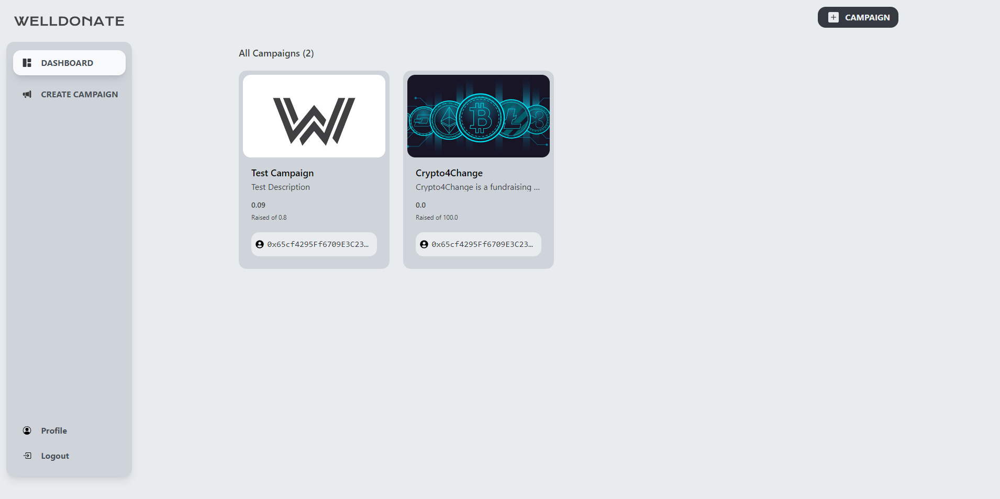
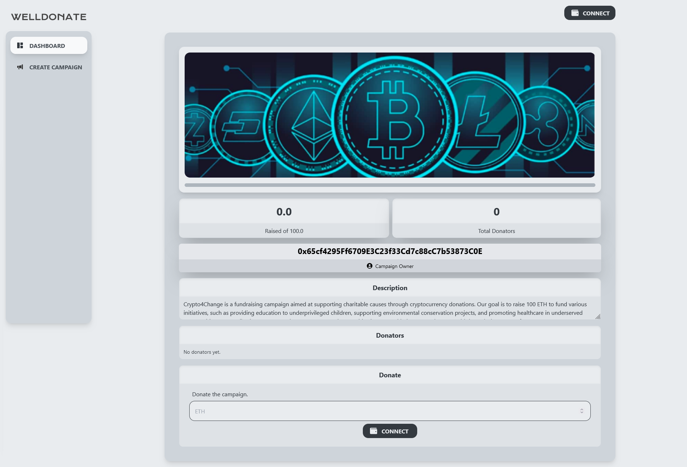
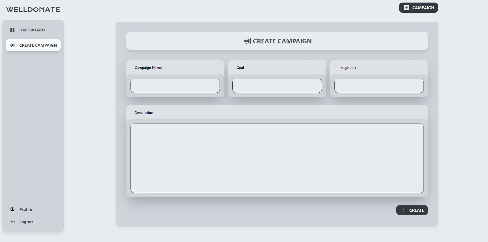

# Project Name: Web3Crowdfunding

[Live Demo](https://welldonate.netlify.app/)

## Description
Web3Crowdfunding is a decentralized crowdfunding platform built on the Ethereum blockchain. It leverages the power of Web3 technologies to provide a transparent, secure, and efficient way for individuals and organizations to raise funds for their projects, campaigns, and causes. 

With Web3Crowdfunding, you can create and manage your own crowdfunding campaigns, set fundraising goals, and accept donations in cryptocurrencies such as ETH. Backers can contribute to campaigns directly from their crypto wallets, ensuring a seamless and trustless experience.

This project aims to revolutionize the traditional crowdfunding model by eliminating intermediaries, reducing fees, and providing global accessibility. By embracing the decentralized nature of blockchain, Web3Crowdfunding empowers both creators and backers, enabling them to participate in impactful projects and initiatives across various industries.

## Features
- Create and manage crowdfunding campaigns
- Set fundraising goals in ETH
- Accept cryptocurrency donations securely
- Real-time updates on campaign progress
- Transparent tracking of contributions and disbursements
- Secure integration with popular crypto wallets
- User-friendly interface for easy navigation
- Global accessibility for both creators and backers

## Screenshots

*Caption: Dashboard*

*Caption: Campaign details page*

*Caption: Campaign creation page*

## Technologies Used
- Ethereum blockchain
- Solidity smart contracts
- thirdweb.js
- React
- Typescript
- Node.js
- Metamask wallet integration

## Installation
1. Clone the repository: `git clone https://github.com/b9aurav/welldonate.git`
2. Install dependencies: `npm install`
3. Start the application: `npm run start`
4. Access the application via your browser at `http://localhost:3000`

## Usage
1. Connect your Ethereum wallet (e.g., Metamask) to the application.
2. Create a new campaign by providing campaign details and setting the fundraising goal.
3. Share the campaign link with potential backers.
4. Backers can contribute to the campaign by selecting the desired donation amount and confirming the transaction through their wallet.
5. Campaign progress and donation details can be tracked in real-time.
